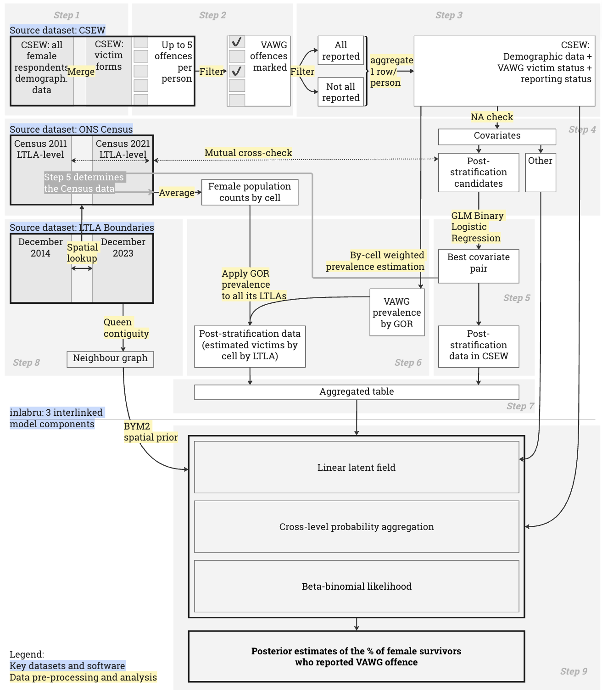

# Towards Understanding Underreporting of Violence Against Women and Girls in England and Wales
**Using the Areal Disaggregation Model to Produce Local Underreporting Probability Estimates**

This repository contains the code accompanying an MSc dissertation completed at the Centre for Advanced Spatial Analysis (CASA), Bartlett Faculty of the Built Environment, University College London (UCL). The study applies the Areal Disaggregation framework (Wu, Lindgren and Hanson, 2026) to safeguarded Crime Survey for England and Wales (CSEW) data to estimate the probability of reporting Violence Against Women and Girls (VAWG) at the Lower Tier Local Authority (LTLA) level from regional-level geography.

## Repository Structure

### data

Contains the folder structure for the datasets used in the analysis. Please note:
* Safeguarded CSEW data are not included in this repository due to data access and usage conditions. To reuse the code, download the safeguarded CSEW as .tab files for the years of interest
* Shapefiles and other large spatial datasets are also excluded due to file size.

### figures

Contains the main graphical outputs used in the dissertation.
The overall analytical workflow is illustrated below:

### scripts

Contains all analysis code, organised into sequential steps. These step numbers are also referenced in the analysis workflow above and throughout the dissertation. Scripts should be run in alphanumeric order.

## Main Modelling Script

The main modelling stage is contained in:

`Step 7_8_9_aggregation_adjacency_inlabru_plots.Rmd`

This script includes the implementation of the spatial model using **inlabru**.

## Data Availability

The safeguarded CSEW data required to reproduce parts of the analysis cannot be redistributed through this repository. Users wishing to reproduce the full analysis will need to obtain the relevant data through the appropriate authorised access procedures.

## Citation

This repository accompanies an MSc dissertation submitted to the Centre for Advanced Spatial Analysis, UCL.

The methodological framework used in the study is based on:

Wu, Y., Lindgren, F. and Hanson, H.A. (2026) ‘Areal Disaggregation: A Small Area Estimation Perspective’. arXiv. Available at: https://doi.org/10.48550/arXiv.2603.04246. 

The survey preparation code is based on:

Blom, N. (2023) ‘Code for Merging Waves of the Crime Survey of England and Wales and the British Crime Survey, 1982-2020’. UK Data Service. Available at: https://doi.org/10.5255/UKDA-SN-856494. 

Inlabru package:

Bachl, F.E. et al. (2019) ‘inlabru: an R package for Bayesian spatial modelling from ecological survey data’, Methods in Ecology and Evolution. Edited by R. Freckleton, 10(6), pp. 760–766. Available at: https://doi.org/10.1111/2041-210X.13168. 

Data used:

Office For National Statistics (2023) ‘Crime Survey for England and Wales’. UK Data Service. Available at: https://doi.org/10.5255/UKDA-SERIES-200009. 

Office for National Statistics (2011) ‘LC6107EW - Economic activity status by sex by age’. Nomis. Available at: https://www.nomisweb.co.uk/census/2011/lc6107ew (Accessed: 31 July 2026). 

Office for National Statistics (2023) ‘Local Authority Districts (December 2014) Boundaries GB BFC’. Available at: https://open-geography-portalx-ons.hub.arcgis.com/datasets/ons::local-authority-districts-december-2014-boundaries-gb-bfc/about (Accessed: 27 July 2026). 

Office for National Statistics (2024) ‘Local Authority Districts (December 2023) Boundaries UK BFC’. Available at: https://geoportal.statistics.gov.uk/datasets/ons::local-authority-districts-december-2023-boundaries-uk-bfc-2/about (Accessed: 27 July 2026). 

